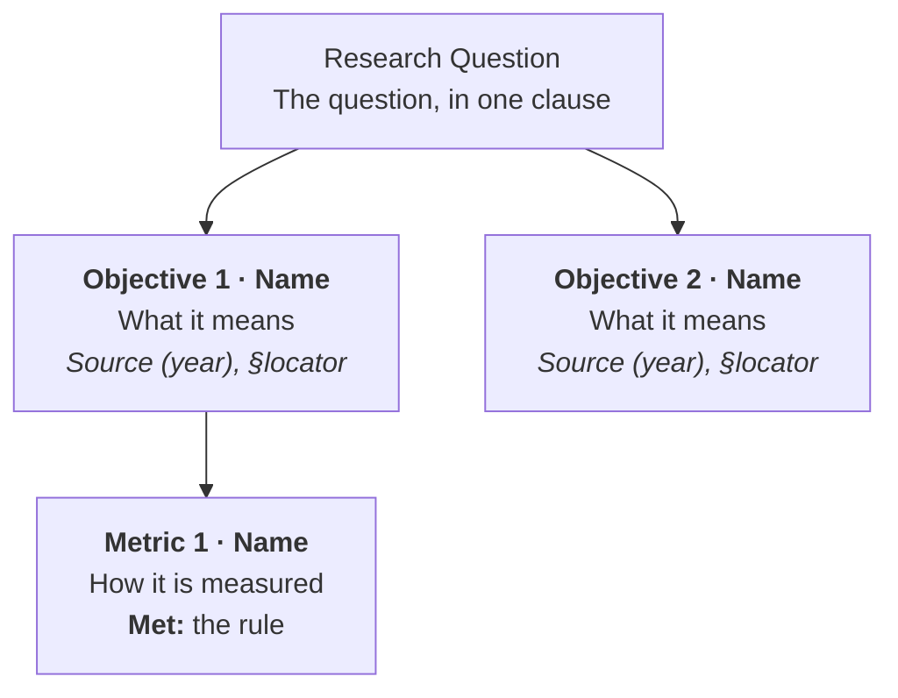

# Mermaid, and the palette it renders with

Mermaid is a text-to-diagram renderer. This reference is what a diagram author
needs: how the theme is derived, what the layout defaults are and why, how to
write a source that reads well as a figure, and where the renderer surprises you.

## Contents

- [The pipeline](#the-pipeline)
- [The mapping](#the-mapping)
- [Layout defaults](#layout-defaults)
- [Writing a source](#writing-a-source)
- [Placing the figure](#placing-the-figure)
- [Gotchas](#gotchas)

## The pipeline

```
palette  ──(diagramkit.theme)──▶  mermaid-theme.json  ──(mermaid-cli)──▶  figure.png
theme.json                        themeVariables,                         3136x1348
                                  themeCSS, flowchart
```

Three facts about it:

- **The theme is derived, never authored.** `diagramkit/theme.py` maps a role
  name to a Mermaid variable. There is no colour literal in a `.mmd`.
- **`themeCSS` carries what Mermaid has no variable for.** Node and edge stroke
  widths are CSS, because `themeVariables` cannot express them.
- **The renderer is pinned.** `@mermaid-js/mermaid-cli@11.17.0`, overridable with
  `DIAGRAMS_MERMAID_CLI` so a bump is a decision rather than a side effect.
  Background is always `white` and scale always `4`, because a figure is embedded
  on a white surface and a 3136px render stays crisp at 11in wide.

## The mapping

Read from the theme's `palette`, except the two `diagram.*` slots, which are read
from the theme's optional `diagram` block.

| Mermaid variable | source | why |
|---|---|---|
| `primaryColor` | `diagram.node_fill` | the node surface; a deckkit tint is too pale to read as a shape |
| `mainBkg` | `diagram.node_fill` | the same surface, for the older variable name |
| `primaryBorderColor`, `nodeBorder` | `accent` | the node outline is the deck's spine colour |
| `lineColor` | `accent` | edges and arrows |
| `textColor`, `primaryTextColor` | `ink` | label text |
| `secondaryColor` | `secondary_light` | a second surface, when a diagram needs one |
| `secondaryBorderColor` | `secondary` | its outline |
| `secondaryTextColor` | `ink` | its label |
| `tertiaryColor` | `paper` | a third surface |
| `tertiaryBorderColor` | `diagram.cluster_edge` | the warm rule the paper's figures use for a subgraph |
| `clusterBkg` | `paper` | a subgraph's fill |
| `clusterBorder` | `diagram.cluster_edge` | a subgraph's outline |
| `background`, `edgeLabelBackground` | `white` | a figure is embedded on white |
| `fontFamily` | `type.font` + `, sans-serif` | the figure must agree with the slide text |
| `fontSize` | `diagram.font_size` | 18px by default |

A `diagram` block is two colours and a size in the common case:

```json
"diagram": { "node_fill": "A4C5C4", "cluster_edge": "C7A183", "font_size": 18 }
```

Those two colours are the ones a deckkit palette cannot express. A deckkit palette
is built for panels on white, so its tints are pale; a node wants body, and a
cluster rule wants a warm tone rather than the darker `caution`. A theme without
the block still renders — it falls back to `accent_light` and `caution` — because a
washed-out node is a look to fix, not a broken build.

Hex is written bare in the palette and prefixed with `#` for Mermaid by the
derivation. Without the prefix the renderer fails inside the browser with an
unhelpful puppeteer stack.

## Layout defaults

Overridable from the `diagram` block; the defaults are the result of measurement.

| key | default | why |
|---|---|---|
| `wrapping_width` | `520` | **the one that matters.** Mermaid wraps a label at about 200px. A three-column fan-out then becomes three narrow towers, and the diagram is nearly square: measured, 3136×3032, aspect 1.03. At 520 the same tree is 3136×1348, aspect 2.33, which sits on a slide. |
| `node_spacing` | `34` | sibling gap |
| `rank_spacing` | `38` | level gap |
| `curve` | `linear` | a curved edge in a hierarchy reads as decoration |
| `stroke` | `1.5px` | matches the weight of the paper's matplotlib figures |
| `font_size` | `18` | the size that survives being placed at 11in wide |

The aspect is not a preference. If a figure will not fit, change the node text —
fewer lines, shorter labels — rather than shrinking the figure on the slide.

## Writing a source



Rules that keep a diagram readable at slide size:

- **Structure only.** No `style` lines, no `classDef`, no colour. The theme owns
  colour, and a literal in the source is the drift the whole pipeline prevents.
- **One idea per node.** `Objective 1 · Behavior Preservation` and one line of
  meaning. If a node needs a paragraph, it belongs in a panel beside the figure.
- **`<b>` for the node's name, `<i>` for its provenance.** The italic line is how
  a citation reads as provenance rather than as body text.
- **The source locator belongs in the diagram when the diagram's job is to show
  derivation.** A tree from a question to objectives to metrics is exactly that
  case: the reader should see that the constructs are derived, not asserted.
- **`TB` for a hierarchy, `LR` for a sequence.** A tree laid out left-to-right
  reads as a pipeline, which is usually a lie about the structure.
- **Name the file for the figure, not the slide** — `fig-objectives.mmd`, not
  `slide-11.mmd`. A slide number changes; the figure does not.

## Placing the figure

```python
s.picture(FIG / "fig-objectives.png", s.x, s.top, s.w, 4.72,
          alt="One sentence: what the figure shows",
          credit="Eigene Darstellung; Quellen im Diagramm")
```

`layout.picture()` fits the image inside the box and never distorts it, so pass
the box and let the aspect decide the rest. `alt` is an obligation; `credit` is
academic provenance — a reproduced figure names its source, an own figure says
`Eigene Darstellung`. `deck check` reports `figure` when both are missing.

Leave room for the slide's claim bar. A figure that ends at the body floor leaves
the assertion nowhere to go.

## Gotchas

- **A missing `#` fails inside the browser.** The error is a puppeteer stack, not
  a message about colour. The derivation adds the prefix; a hand-edited theme
  config might not.
- **The first render downloads Chromium.** About 150 MB, once. `doctor` reports
  whether it is present.
- **`-c` is the Mermaid config, not a puppeteer config.** `-p` is the puppeteer
  one. Passing a puppeteer file to `-c` produces a diagram with no theme and no
  error.
- **`wrappingWidth` is a `flowchart` key, not a `themeVariables` key.** Putting it
  in the wrong object silently does nothing, and the diagram comes out square.
- **A label with `::` or an unescaped `"` breaks the parse.** Quote the node text
  and avoid the separator.
