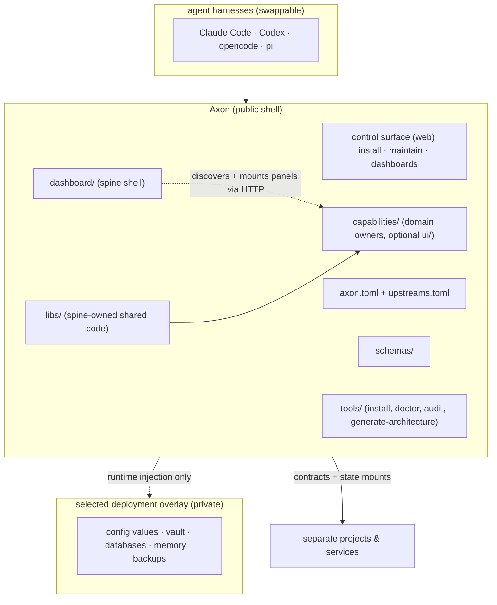

<!-- human-voice: ignore-start rule_of_three -->
<!-- This file enumerates real sets constantly (the four things the spine owns, the three
     surfaces of the control app, the log kinds security covers). Several flagged "triads" are
     four-item lists the check reads as three. Shortening them would delete information to move
     a score, so the category is muted here deliberately — every other check stays live. -->

# Axon

My integration platform, for me and my agents both: AI usage, adopted tooling, and the tools I
actually build, wired together instead of living as separate silos I have to remember to check.
Public shell, so anyone can run their own deployment; one active private overlay holds
everything instance-specific and injects it at runtime — never the reverse. An overlay may
describe several cooperating hosts and user access scopes without forking the public core.

## The one idea

Axon is not "a monorepo", and not just an agent layer. A spine owns contracts, identity,
orchestration, and machine setup; capabilities each either wrap an existing tool (adapter) or
are built from scratch (Rust services). Everything speaks the shared schemas, and **everything
is a plugin from the core**: an installation enables only the capabilities its owner needs, so
one person runs Axon with three plugins while another runs thirty.

## Start here

Axon supports macOS and Linux. The guided installer detects the platform, creates or connects a
private deployment overlay, writes the local machine manifest, and leaves existing state alone.

~~~sh
git clone https://github.com/larsboes/Axon.git
cd Axon
tools/install.sh --help
tools/install.sh
tools/doctor
~~~

Read the prompt before choosing an overlay location or cloning a private remote. Missing host
tools are reported with platform-specific installation hints from `toolchain.toml`; the installer
does not hide or auto-install them. Contributors who only need the source and test suite can skip
the operating setup and use [CONTRIBUTING.md](CONTRIBUTING.md).

## Operating values

These are design tests, not aspirations. A value only counts when it changes a placement,
contract, install, or review decision.

1. **Lean runtime, growing monorepo.** A fresh install enables a small useful core. The repo
   may hold far more — optional capabilities, Packs, public reference projects — and none of
   that may become a runtime prerequisite.
2. **One feed, many views.** Capabilities keep domain ownership, but publish typed events with
   provenance, time, confidence and state. The dashboard sorts and connects those events; it
   does not become another data silo.
3. **Data and mechanism never blur.** Axon owns public code, schemas, renderers and explicitly
   public first-party datasets. The active private overlay owns private content, secrets, machine
   configuration and history. Both sides use the same bounded
   contracts: data may select an allow-listed behavior, never become executable code.
4. **Evidence before automation.** Every surfaced claim keeps its source, evidence boundary and
   decision state. Agents rank and explain; anything irreversible still goes through the
   capability contract, and leaves a trace.
5. **Security is continuous observation.** Pinned dependencies and audit gates are only the
   start. Egress, access and agent touches stay observable after install; their logs live
   privately.
6. **Replaceable edges, stable contracts.** Agent harnesses, model providers, visual renderers
   and deployment substrates are adapters. Adopt first and record why. Re-open the call when
   its stated flip condition comes true.
7. **Self-hosted by default, distributed when earned.** One home-server deployment should serve
   phone and desktop clients. Kubernetes, WASM or a native shell enter only for a measured
   portability, isolation or performance need.
8. **English is the shared surface.** Axon-authored interfaces, documentation, prompts,
   summaries, explanations and errors default to English. Source material and explicitly
   locale-specific capabilities may remain multilingual; accepting multilingual input must not
   silently change Axon's output language.

## Feed, Scouting, and Obsidian boundaries

“One feed” means one general observation stream, not one opportunity engine. A feed item is
anything the operator may need to notice: a security advisory, system or package update,
change in a watched repository, news item, useful article, scholarship, hackathon, event, or a
future source that fits the same typed observation contract. Each item keeps its source,
observed time, evidence link, kind and decision state. The originating capability keeps any
domain-specific payload.

`comms` currently supplies the feed store, manual link ingest and mail triage. Its present
extractors do not define the feed's future scope. Its first bounded recurring collectors are
GitHub Trending and configurable arXiv queries. A new source belongs in the general feed when
its first job is awareness or reading.

Personal relevance is a Feed annotation, not a new ownership boundary. Comms scores an item
against explicitly configured TELOS focus notes, stores the matches separately from the item
and labels whether the comparison was semantic or a lexical fallback. The dashboard can sort
by a revisioned deterministic evaluation whose visible factors currently cover TELOS fit,
freshness and content basis. Only missing or changed item/profile/evaluator revisions are
recomputed. `/feed/[id]` remains one dynamic reader for every item instead of generating one
application page per link.

The dashboard presents passive intake and active discovery as two views of the same `/feed`
workspace: **Inbox** reads Comms, while **Discover** starts and reads Scouting. This is a UI
integration, not a database merge; the capabilities retain separate contracts and provenance.

Narrower by design, `scouting` searches for and scores opportunities such as
scholarships, hackathons, events, calls for papers or travel deals against an interest
profile. It may accept a feed item as a candidate and may publish a scored result back to the
feed, but it does not own security updates, system changes, watched repositories, general news
or interesting articles. Those remain valid feed items without ever entering Scouting.

Obsidian is an external personal writing surface, not a second Axon-wide database. Each
capability owns its own explicit vault contract: `comms` can discover links only in configured
exact notes or headings and can export a distilled keeper, `scouting` can read typed
opportunity notes and link matches, and `trips` can import or later synchronize trip plans.
The Comms scan is metadata-only; fetching a candidate still needs an import action, and a
missing requested heading produces no candidates rather than a whole-note fallback. These
integrations may share schemas and source references, but one must never scan or rewrite
another capability's notes by implication.

The harness-swappable, public-core-plus-private-overlay shape isn't invented from nothing. It
descends from Daniel Miessler's [LifeOS](https://github.com/danielmiessler/LifeOS), the upstream
AI-operator project. Axon carried a reviewed delta against a LifeOS installation until
2026-08-25, when that delta and its sync tooling were deleted; the shape it taught stayed. See
`upstreams.toml`'s `[lifeos]` entry for what was consumed and why it stopped.

Two orthogonal decisions, kept separate on purpose:

- **base + plugin** is the architecture: the core defines contracts, extensions implement them.
- **topology** is integrate-first: personal projects converge into Axon (+ the overlay for
  their private halves). A project keeps its own repo only for a hard reason: independent
  product identity, a device-sync lifecycle of its own (e.g. a mobile-synced vault),
  collaboration, or being the private overlay itself. Separate projects integrate via
  contracts and are registered as state mounts, never left untracked. The overlay relationship
  recurses: a capability with more than one non-interchangeable deployment still gets exactly
  one shared pattern in Axon. Each deployment selects an overlay; several hosts may consume that
  same overlay when they form one operational trust boundary.

## Architecture and ownership

### Public core and private overlays

Axon contains everything that can be public. Private data, vault contents, backups and deployment
configuration live in one selected overlay. A host, residence or user account is not automatically
a repository boundary: split overlays only when their trust, lifecycle or ownership genuinely
cannot be managed together. Access control belongs at the service and data-contract boundary.

Nothing private or secret enters this repository. Explicitly published work and its reviewed
public data may; unreviewed personal material may not. This is a commit-level property, not a
cleanup step before release.

"Private" is not only about values. A set of entries can identify a place or a person while
every single one of them is harmless on its own: which third-party integrations a deployment
pins, which automations it has, which services it runs. Each pin points at a public
repository and each template holds nothing but placeholders, and the list still describes the
hardware in one building. Filenames do it too, with no value in them at all. So a capability
here keeps the mechanism — how a service runs, how templates are filled, how upstreams are
pinned and audited — while the selected overlay keeps the inventory of what a particular
installation actually has. `tools/check-publication-hygiene.sh` catches repository names and
workstation paths; it cannot see aggregation, which is why this is a rule rather than a gate.

### What the installer owns in an agent harness

`~/.claude` belongs to its operator, not to Axon, and the installer's authority over it stops at an
additive merge of a baseline Axon owns, plus offers. Stated here because the discipline was already
implemented in three separate tools and written down in none, which is the shape a boundary erodes
in.

`tools/claude-code-config` is the one write that happens without being asked, on every install
including a non-interactive one. It merges the USER layer into `settings.json` with existing keys
winning, so it can add a default and can never remove or overwrite one the operator set, and it
refuses to touch a `settings.json` it cannot parse rather than replacing it. The MANAGED layer at
`/etc/claude-code` *is* a full replace — and the installer never deploys it, only prints the sudo
command, because a security policy that arrives unasked is not one anybody chose.

Nothing else writes unasked. The installer lists Packs and prints the activation command; it never
links one. Agent-harness integrations are read for status, then installed only behind a TTY and an
explicit prompt that defaults to no. Every destination is a default rather than an assumption:
`CLAUDE_CONFIG_DIR`, `CLAUDE_SKILLS_DIR` and `CLAUDE_AGENTS_DIR` move them, and a harness that is
not present is reported and skipped.

### Integrate-first topology

A personal or self-authored project folds into Axon by default. It stays separate only when it has
an independent product identity, a device-sync lifecycle of its own, collaborators, or is itself
an overlay. Separate projects integrate through declared contracts and state mounts. They are
never left as invisible local dependencies.

Base-plus-plugin and repository topology are separate decisions. The base defines contracts and
extensions implement them; integrate-first decides where a project lives. Neither implies the
other.

### Three architectural nouns

Axon uses three nouns and no residual category:

- **Spine** is the fresh-install core: root manifests, `schemas/`, `tools/`, `libs/` and the
  `dashboard/` shell. There is no literal `spine/` directory.
- **Capability** owns a bounded domain, external system or data store under
  `capabilities/<name>/`, whether or not it has a container or another capability consumes it.
- **Pack** holds public agent know-how under `Packs/` and drives capabilities through their
  contracts.

Shared code with no domain belongs in `libs/`; shared contracts belong in `schemas/`; operator
machinery belongs in `tools/`. If a piece fits none of them, its boundary is wrong. Do not create
`utils/`, a fourth top-level noun, or a parent directory grouping capabilities merely because they
run on the same host.

### Schemas and dependency direction

`schemas/` is law: import shared contracts, never redefine them. Compile-time dependencies point
downward from capability to spine. A capability that needs another service declares
`requires = [...]` and uses its HTTP surface and schema, never its implementation. Promote code to
`libs/` at the second real consumer, provided it owns no domain of its own.

The dashboard is presentation only. It discovers and mounts capability surfaces but owns no
domain state or business logic. A UI serving one capability lives under that capability and
arrives or leaves with it.

## Dependencies and build

### Upstream-first

Choose in this order: adopt, contribute upstream, overlay a pinned source, use a fork only as a
temporary contribution vehicle, then build. A maintained fork is another copy of the same logic
and drifts for the same reason duplicated configuration does.

### Cargo and bun are the build path

`cargo` builds and tests the Rust workspace: one root workspace, one `Cargo.lock`, and each member
manifest owning its own direct dependencies. A service manifest names its `target/release` binary,
and `tools/service-runner.sh` builds that binary on demand. `bun` owns TypeScript and the UI
bundles. Generated-architecture freshness is a script gate, `tools/check-architecture-fresh.sh`,
not a build-graph target. PRD Q44 (2026-08-25) decided this and retired the Bazel graph that held
the same jobs before it.

Any build layer above those two is argued per case, never assumed. Name what it buys and what
toolchain cost it adds. `tools/doctor` stays an interpreted command because wrapping it would add
machinery without improving correctness. The dashboard build was deliberately reopened when
production began consuming capability-owned UI bundles; its README records that trigger.

### Implementation languages and intelligence

New backend logic defaults to Rust. Choose the lowest rung that can solve the problem and justify
every move upward: heuristic, algorithm, classical machine learning, local AI, cloud AI. A model is
not a substitute for a deterministic baseline it has not beaten.

### One manifest per concern

Configuration has one owner per concern:

| Manifest | Owns |
| --- | --- |
| `axon.toml` | Shared platform defaults and the shipped overlay fallback; never machine-specific state |
| `axon.local.toml` | This checkout's active overlay location; gitignored and written by the installer |
| `upstreams.toml` | External code and adopted influence: verdict, pin, license and why |
| `toolchain.toml` | Host executables Axon commands assume, with requiredness, scope and install hints |
| `systems.toml` | Systems, services and projects that have a role in the setup |
| `<overlay>/config/machine.toml` | OS, container runtime, enabled capabilities and state mounts for this machine. An overlay owning several machines uses `<overlay>/config/machines/<name>.toml` instead, selected by `axon.local.toml` or the hostname |
| `<overlay>/config/deployment.env` | facts true of the whole deployment rather than one machine or one capability — the home timezone, and `AXON_INBOUND_TOKEN_FILE`, the reference to the shared secret every capability server authenticates inbound requests against (`libs/axon-server/README.md`). Declared once because several capabilities need it and independent copies drift silently (`schemas/deployment.env.example`) |

`tools/lib/toml.sh` is the parser for single-line scalar and array fields. More complex TOML goes
through the shared Bun parser; no caller grows another partial parser or duplicates manifest data.
Event sources follow the same pattern: declared configuration, never values spread through code.

Host requirements are scoped, not global. `toolchain.toml`'s `needed_by` says where an entry
applies: absent means every machine, `workflow:<name>` means only when that workflow is asked
about, and `capability-field:<field>` derives from the enabled set so the requirement follows the
capability when it moves host. A runtime node is therefore never told to install a scanner it has
no path to invoke, and a tool that is out of scope is reported as `n/a` naming what would pull it
in rather than omitted. Run the scoped check after changing what a machine is enabled to do, and
run it for a workflow before invoking one:

```sh
tools/toolchain-check                    # this machine: core + enabled capabilities + runtime
tools/toolchain-check --workflow restore # before a restore, not after it holds a service down
```

### State mounts record reality

Axon does not relocate an adopted tool's data directory. The active machine manifest records where
the tool really persists data, its class, sync policy and direction. Backup and monitoring walk
that registry. Dotfiles and shell configuration are state mounts with injection direction, not
special cases.

## Security and data

### Dependency verdicts and provenance

Every consumed external dependency gets a verdict in `upstreams.toml` first. **No entry, no
entry.** The manifest records, per upstream, the verdict, the pin, the licence and the `why` that
argues for it — and that rule is unchanged. The consuming README also records the canonical URL
and what Axon adopted: runtime, idea, architecture, algorithm, code or asset. A local clone or
archive path is never durable provenance.

What changed on 2026-09-02 (Q74) is who checks what, and how fast a fix lands. What is
required is unchanged.

| Question | Answered by |
|---|---|
| Is there a verdict, a pin, a licence and a reason? | `upstreams.toml` itself, read by a human at review time |
| Is a newer release out? | Dependabot version updates — `.github/dependabot.yml`, one grouped pull request per ecosystem per day, with no cooldown |
| Is a locked dependency known-vulnerable? | Dependabot alerts and security updates, and `osv-scanner` in `.github/workflows/security.yml` and in `tools/audit` |
| Is there a CVE in a pinned capability image? | `grype registry:<image>:<tag>` in `security.yml`, weekly. No container runtime and no local pull |
| Is there a secret in this repository? | GitHub secret scanning, with push protection — and `gitleaks` in `tools/audit`, which reads history the push protection never saw |
| Is there a secret in the private overlay? | `tools/audit` alone. GitHub charges for secret scanning on a private repository, and this repository's CI cannot reach the overlay, so this is the one scan that has to be local |
| Is there a flaw in the code as written? | CodeQL — `.github/workflows/codeql.yml`, `security-extended` over rust, javascript-typescript, python and actions |
| Is a host package behind? | Nothing asks. `capabilities/host-patch` upgrades this machine every day |

`upstreams.toml` is documentation, and only documentation. Nothing enforces its fields. A human
reads a verdict before adopting a dependency, which was always the actual rule. One script still
reads a `pin` — `tools/agent-integrations.sh` drives an upstream's own installer at its pinned
version — and `tools/self.ts` publishes verdict and pin into `self.json`. Neither enforces
anything.

`pin_kind`, `tracked_by` and `installed_probe` were deleted on 2026-09-02. Each existed to
describe an opt-out from `renovate.json5`'s release watch, and that file went with the cooldown.
`installed_probe` named how to ask *this* machine what it really has, and under patch-first the
answer is "whatever brew installed last night" — the question stops being askable rather than
stopping being asked. What each deleted line said is still in the manifest's git history.

**Two gaps, named rather than left to be inferred from a green check.** Shell is scanned by
nothing: CodeQL has no shell extractor, `semgrep` was retired with the rest of the set, and
0.44 MB of `tools/` is the largest hand-written surface here. And nothing detects a malicious
release — see [Patch first](#patch-first) for why that trade was taken.

### Patch first

This section was **Pins and cooldown** until 2026-09-02, and an `upstreams.toml` entry dated
before then was decided under the hold it described. Those entries still point here; their text is
left as written, because rewriting a decision's reasoning to match a later rule falsifies it.

Take the patch. There is no adoption cooldown, on the host or in this repository. Q74
removed it.

The hold asked a release to age seven to fourteen days before adoption, on the argument that the
ecosystem finds a compromised publish in days and reading the dependency tree yourself cannot.
That argument is still true, and it was traded away deliberately. The same window that catches a
poisoned release also holds every ordinary security fix, and this deployment has one operator: a
hold that needs a human to end it is a hold that ends late. What was measured on the day of the
ruling is why the trade is defensible rather than merely chosen — Homebrew formulae sat outdated
with no updater configured at all, `openssl@3`, `gnupg`, `libgcrypt`, `nss` and `ffmpeg` among
them, while the bot that was to enforce the hold had never been installed. The hold was guarding a
door that was already open.

**What replaces it is speed and reporting, not silence.** `capabilities/host-patch` runs
`tools/host-patch.sh` every 24 hours — `brew update`, `brew upgrade`, `brew cleanup`,
`uv tool upgrade --all`, `rustup update`, then `tools/audit` — and writes a receipt the next
`tools/doctor` reads out, because a scheduled job's real failure is that it quietly stops running.
`.github/dependabot.yml` opens the repository half daily, with `cooldown: default-days: 0` written
out in every block so the three-day default cannot creep the hold back in.
`.github/workflows/security.yml`, CodeQL and GitHub's advisory alerts are what now stand between
a bad publish and this machine.

**The named cost.** A compromised publish now reaches this host within a day instead of after a
seven-day hold. Nothing here detects that class: a scanner reads advisories, and the advisory for
a malicious release is written after somebody finds it. What stands against it is smallness and
reading — every entry in `upstreams.toml` carries a human verdict, and `bun install` never runs a
lifecycle hook (`tools/check-bun-install-policy.sh`), which is the path ChainDrop took.

**One binary, one owner.** On macOS `brew` owns `bun`, `uv`, `gitleaks` and `osv-scanner`, so
`host-patch.sh` never calls `bun upgrade` or `uv self update`. A second updater for one file is
how a `~/.local/bin` copy comes to shadow the `brew` one and answer differently — the PRD records
that happening to `yt-dlp`, which returned HTTP 403 on every media URL while `--dump-json` kept
working.

**Never consume `:latest`, and pin anyway.** `tools/check-service-tomls.sh` still refuses a
floating image tag, because a deploy that cannot be reproduced cannot be diagnosed. What changed is
the waiting, not the pinning. For a host tool a package manager owns, the `pin` records the version
its `why` was written against, not the version installed today — `host-patch` moves the installed
one nightly and nothing here objects. Audit the delta rather than the world. Not every correct pin
is a release: a commit sha is right for a repository that cuts no releases, and an image tag is
right for what it names.

**The Bun the workflows install is `latest`.** `oven-sh/setup-bun` is asked for `bun-version:
latest` in both workflows, so CI runs the runtime a contributor's package manager just gave them.
It was three pinned literals and `tools/check-bun-pin.sh` keeping them equal until 2026-09-02; with
no literal left there is nothing to diverge, and the class that gate caught is impossible rather
than watched. `upstreams.toml [bun]` keeps a `pin` as the record of what its verdict was written
against. The cost is stated rather than hidden: a bad Bun release can turn CI red for a reason
unrelated to the code, which is the same trade `security.yml` makes for its scanners.

`capabilities/agentbox`'s host-install keeps the sha256 verification of the release archive and the
printed advisory reminder. The cooldown half, and the separate `gate` verb that was left holding
only it, are gone.

### Secrets

Secret values live in Vaultwarden, never in this repository or an overlay note. A capability may
materialize a real value only into its gitignored runtime environment because the service consumes
plaintext environment variables. Creating or changing one requires the user to run
`tools/setup-secret.sh` interactively after explicit, specific approval. A general “continue” is
not authorization. A pre-Vaultwarden bootstrap exception must be argued when a real need exists;
none exists today.

### Data classes

The data classes are `c0` Public, `c1` Mine, `c2` Others, `c3` Secret, ranked in that order. `c0`
and `c1` may reach a cloud model (`c1` only as a redacted derivative); `c2` and `c3` redact before
persistence and never reach a cloud model.

The policy is one function: `content_item::cloud_admission` in `libs/content-item`, a leaf crate
every capability already depends on. It admits two representations — `c0` unchanged to any declared
tier, and `c1` as a reviewed `c1` derivative to the `pseudonymized_personal` tier — and refuses
everything else, including every class outside the vocabulary. The `processing_policy` a reader is
shown is *derived* from it, so the label and the gate cannot disagree; they used to be two
expressions and did.

Enforced today, mechanically, on four independent gates: `cloud_derivative::prepare` builds no
approvable preview for anything that is not `c0` or `c1`, `cloud_derivative::tier_allows` (a thin
wrapper over `cloud_admission` that adds the transformation-version pin) refuses the dispatch,
dispatch re-reads the source row's **current** class so a derivative approved at `c1` stops
dispatching once the row becomes `c2`, and the `comms_content_cloud_derivatives` CHECK constraint
refuses the row.

`c3` is refused every local prompt too, and that is now a gate rather than a declaration:
`content_item::local_prompt_allowed` answers `false` for `c3` and for any unrecognized value, both
prompt-builders that read stored text ask it before they build a prompt —
`capabilities/comms/src/digest.rs` (digest, diagram and chart) and `capabilities/comms/src/media.rs`
(`summarize`) — and `processing_policy(..).local_processing` is derived from the same function. A
refused item gets a `local_refused` row that says so, not a missing one. Embed and rerank
(`libs/inference`) stay class-blind and loopback-or-nothing.

Data may select an allow-listed behavior but may not become executable code.

### Backups before migrations

No data migration starts without a tested 3-2-1 backup. A command being reversible in source
control does not make its state mutation reversible.

`tools/backup.sh <capability>` writes a self-describing archive, ships it under a partial name,
verifies the remote byte count before renaming it, applies the capability's retention policy, and
records the archive size and SHA-256 in the private receipt. The receipt also records whether
retention ran. A shipment receipt proves delivery, not recovery.

For a recovery rehearsal, run `tools/backup.sh --no-prune <capability>`. This mode ships and
verifies a new archive but does not list or delete older archives. A capability that declares
`backup_sqlite` stays held while all declared host paths and the cold database copy are staged and
the staged copy passes `integrity_check`; it resumes before compression or network access. Failure
or interruption after the hold triggers a resume attempt and exits without shipping the staged
snapshot. A capability that declares `backup_sqlite_online` instead is never held: its database is
copied open, through `sqlite3 .backup`, and the archive records how many tables and rows the copy
held so a restore can check that they came back. That form is correct only where every reader is a
host process on this machine, which is the condition SQLite's WAL states and a container behind a
virtiofs mount does not meet.

Retrieve that new archive into a private scratch location, compare its SHA-256 with the receipt,
then run `tools/restore.sh <capability> <archive> --receipt <receipt.json>`. The explicit receipt
makes the command reject the wrong capability, archive name, byte count or SHA-256 before
extraction. Restore defaults to a new `/tmp` directory and refuses the Axon checkout or active
overlay as a destination. It separates the recovery stages explicitly:

1. **Retrieve:** copy the named archive from the backup target without applying it.
2. **Extract:** validate archive structure and capability identity, then extract into isolation.
3. **Restore:** expand container-path archives with their recorded modes.
4. **Verify:** require declared roots, run SQLite integrity checking on every declared database,
   and compare an online copy's table and row counts against the numbers the archive recorded.
5. **Clean up:** inspect and then remove the retained scratch tree manually. The tool never
   removes the extracted evidence.

The rehearsal ends in that isolated scratch tree. It never applies recovered files to the live
overlay or starts a restored service against live paths. Any live replacement is a separate,
explicitly approved migration after the recovery evidence has been reviewed.

For a container-path backup, the nested tar remains the ownership and mode authority. Inspect it
with `tar -tvzf <restore-dir>/container-*.tar.gz`; the convenience extraction preserves modes, but
an unprivileged host user cannot re-apply a container's numeric ownership. Apply that archive only
inside the intended disposable or stopped container after the verification pass.

Archives created before the embedded `axon-backup.toml` format require `--allow-legacy`. That mode
uses the standard archive name and current manifest as weaker identity evidence, so it is for a
known private receipt, not an arbitrary file. Actual restore timestamps, digests, application-level
queries and verdicts stay in the private overlay; only a redacted pass/fail result belongs in a
public issue.

Security continues after install: egress, access and agent touches remain observable, while the
logs themselves stay in the private overlay.

## Tooling conventions

### Portable shell

Shell scripts remain compatible with macOS Bash 3.2. Do not use associative arrays, `mapfile`,
`readarray` or another Bash 4-only feature unless the script owns and verifies a newer runtime.

### Language tooling

Use `uv` for Python and `bun` for TypeScript. Do not add `pip`, `npm` or bare `node` commands to
Axon code, launchers or documentation. The runtime choice belongs in `toolchain.toml`; an external
package consumed as code also belongs in `upstreams.toml`.

### Capabilities are data

A container-backed capability is a `service.toml` consumed by the shared service runner and
watchdog, not a new lifecycle script. Before adding a command, ask whether the behavior belongs in
the manifest. A user-facing command shipped by one capability lives with and is named after that
capability; implementation helpers stay off `PATH`.

### Dynamic paths and current facts

Resolve repository, overlay and platform facts through `tools/lib/paths.sh` and
`tools/lib/platform.sh`. Do not duplicate absolute paths or personal directory names. The only
unavoidable bootstrap is the initial `AXON_ROOT` shell setting before any shared resolver can be
found.

Ports, enabled capabilities, health, issue state, test counts, graph size and machine state come
from manifests and tools at runtime. Prose may keep historical measurements and constants that are
part of an argument, but it must not claim a changing count that no gate verifies.

### Public CLI

`axon` is the public command interface for humans and agents. Run `axon help` to discover
operations and `axon search <task>` to narrow the current capability and Pack surface without an
installed agent skill. Repository policy lives in `AGENTS.md`; command help and capability or Pack
contracts own operational detail.

There is deliberately no separate CLI reference. `docs/axon-cli.md` was one, and every row of it
restated something `axon help` already prints — a command table, the harness names, the discovery
instruction `AGENTS.md` carries verbatim. A second copy of a generated surface is the kind of doc
that rots first and is believed longest. `tools/install.sh` owns the installation contract: it
links `~/.local/bin/axon` to the tracked launcher, never overwrites a non-Axon command at that
path, and reports the exact shell-path action when `~/.local/bin` is absent from `PATH`.

## Releases

### The release line

The public spine versions with SemVer, not CalVer. A tag is `vMAJOR.MINOR.PATCH` with all three
components present — `tools/release` refuses any other shape — and `tools/lib/version.sh` orders
tags with `sort -V`.

- **major** — a public contract or architectural shape changes such that an existing overlay needs
  edits to keep working.
- **minor** — a capability or operator-visible feature lands.
- **patch** — fixes only.

Judge a change against those three before opening a pull request. A contract change that ships as a
patch is what breaks an overlay on an update it was told was safe.

Deployment overlays stay untagged. An overlay is deployment state rather than a public release
line, and its commit identity stays independent of the Axon version it runs against.

### Cutting and consuming a release

Tags are created through `tools/release`, never by hand. It gates on a clean tree, on `main`, not
behind `origin/main`, and a passing `tools/doctor`, then generates notes from the manifest-aware
delta in `tools/lib/delta.sh` — the same view `tools/update.sh` shows a consumer, so release notes
and the incoming preview cannot drift apart.

A checkout moves along the line with `tools/update.sh`: fetch, fast-forward, re-run `tools/doctor`.
It never resets, rebases or force-pushes; a checkout that is both ahead and behind is left alone
with instructions rather than silently repaired.

### Getting onto the line

The decided shape is one command that fetches a bootstrap script, which clones and then hands off
to the unchanged `tools/install.sh`. A usage install takes `--depth 1 --branch <tag>`; a
development install takes a full clone. The operator never types `git clone`. That bootstrap is not
written yet — `## Start here` shows the clone that works today — so what follows is the decision,
recorded because the two alternatives were rejected on evidence and should not be reopened without
new evidence.

A shallow usage install is not a dead end: `git fetch --unshallow` promotes it to a development one
without reinstalling. The tree exists either way, because it has to — every tool resolves
`AXON_ROOT` from its own location, and no shape of Axon runs without a directory tree.

**A release tarball instead of a clone was rejected.** Measured at decision time, a `--depth 1`
clone transferred 3.12 MiB and landed 11.4 MB in 586 files — most of that weight a lockfile the
build has since dropped, so the tree is smaller now, not larger. A tarball saves nothing measurable
and costs the update path: `tools/update.sh` is fetch plus fast-forward, so a tarball install would
need a second update mechanism for the same job.

**An install without git at all was rejected.** `git` is already a declared host requirement in
`toolchain.toml`, so skipping it removes no dependency and only removes capability. The run path
would survive — `capability.sh`, `service-runner.sh`, `watchdog.sh` and `packs.sh` make zero git
calls — but `tools/doctor` makes thirteen that carry weight, and `tools/update.sh` and `tools/self`
lose the update path and version truth entirely. Axon's version identity *is* the release tag, so a
git-free install would need a stamped version file, a second source for one fact, plus a second
update mechanism: extracting over an existing tree leaves behind files upstream deleted. New
evidence would be git ceasing to be a host requirement, or the run path growing a consumer that
cannot assume it.

The agent-readable install page is the primary route and the one-liner is the terminal alternative.
Axon's install contains real decisions — overlay location, container runtime, capability selection,
secrets — and an agent walking those with a permission gate per step beats a script asking the same
questions blind. Both land in the same `tools/install.sh` prompts.

## Packs and agent harnesses

### Harness-neutral Packs

`Packs/<name>/pack.toml` plus `skills/` is the neutral source for a togglable agent bundle. Harness
adapters translate that source into their own installation format; harness-specific metadata never
changes the neutral manifest or forks the canonical `SKILL.md`.

### Public skills

Skills stay public and contain no host, IP address, key, personal path or private preset. They
resolve instance values from the active overlay at runtime.

### Skills drive capabilities

A skill is a thin workflow over capability code and contracts. It may teach discovery and safe
operation; it does not embed a second implementation or a static copy of the capability registry.

### Adapter-owned deployment

Each harness adapter owns its wiring and may remove only installations it can prove it owns.
Codex deployment is materialized and drift-checked; destination edits are never overwritten
silently. Other adapters may use a different mechanism, but no installed copy becomes the editing
source.

### Pack documentation and attribution

Every Pack has a README and SPDX license field. Adapted material names its canonical upstream,
exact pin, license and adopted influence. Preserve required notices and nearby lineage comments
where Axon's changes would otherwise obscure origin.

## Documentation

### Documentation stays owned and current

Keep one README per capability or Pack, the root README, manifests, schemas and code. A new document
earns its place only when a workflow or executable consumer needs it. Do not add hand-maintained
status, session or fleet files; `tools/doctor`, Git and the self-model already own that state.

Capability and Pack READMEs explain what the thing solves, its verdict, tradeoffs, provenance and
honest experience. A README may precede implementation when defining the capability is itself the
current work.

Public contributions follow [CONTRIBUTING.md](CONTRIBUTING.md). Report vulnerabilities through
the private route in [SECURITY.md](SECURITY.md), never through a public issue.

### Generated architecture

`ARCHITECTURE.md` is generated from manifests and the tracked tree. Never edit it directly or
maintain a second diagram that can drift. Change its source or generator, regenerate with
`tools/generate-architecture.sh`, and verify with `tools/check-architecture-fresh.sh`.

Graphify is the optional file-and-symbol view. Its local output remains ignored because node IDs
encode the scan path. The committed self-model fuses only reproducible layers with that local graph
and must state when a layer cannot be checked on a fresh clone.

### Decisions live with their owner

Implemented decisions live in code. Reasoning needed to change that code lives beside it. A
rejected alternative belongs under `## Considered and declined` in the affected README. A
capability-wide choice uses `## Why this shape: <topic>`; `tools/doctor` validates that structure
and any declared absent paths. Repository-wide doctrine lives in this README. There is no detached
decision-log directory.

### Scratch is not documentation

`to-integrate/` is ignored pre-git scratch and may never be cited by permanent files. Unjudged external leads belong in the owning ISA's `## Not yet specified`; adopted dependencies and influences pass through `upstreams.toml` and the consuming owner.


### Quarries and one-way migration

Legacy tooling and LifeOS-mono archives are quarries, not dependencies. Migrate
material into Axon deliberately, redact it, verify the new owner, and leave the source until the
user explicitly approves removal. Never bulk-import their history or treat an archive location as
permanent provenance.

### The backlog is ISAs

Open work — plans, todos, phases, anything unfinished — lives in an `ISA.md` and nowhere else.
The root `ISA.md` holds what is repo-wide; a capability or Pack with enough of its own carries one
at its root (`Packs/travel/ISA.md`, `capabilities/places/ISA.md`). `TODO.md`, `PLAN.md`,
`HANDOFF.md` and `ROADMAP.md` remain a retired surface, including gitignored ones — and so is the
issue tracker, which as of 2026-08-19 holds no backlog of ours and which no workflow writes to.

An open item is a claim, and a claim names the probe that would falsify it. That is the whole
reason this moved off a tracker: an issue carries a description and a lifecycle, so closing one
proves nothing was verified, while a claim cannot be checked off without evidence. Git log is the
history — the ISA carries no changelog section of its own.

Reasoning that outlives the work is not backlog: it moves into the owning README as it lands. A
scratch file must never become the thing a permanent file points at for its "why" — that is how
`capabilities/PLAN.md` ended up cited by ten tracked files while being gitignored, in flat
contradiction of the rule directly above this one.

The tracker stays reachable for reports from outside the project. Those are inbound mail, not the
backlog; anything adopted from one becomes a claim in the owning ISA. A capability's testable
ideal state belongs in its `ISA.md`, verified by its own doctor or self-test. Do not invent a new
standing specification type.

## Placement guide

| Adding | Goes in | Boundary |
| --- | --- | --- |
| Bounded domain, external system or data store | `capabilities/<name>/` | Register an upstream verdict before consuming external code |
| User-facing command for one capability | `capabilities/<name>/<name>` | The shell discovers commands by capability name |
| UI serving one capability | `capabilities/<name>/ui/` | Serve it through that capability's HTTP surface |
| Shared code with no domain | `libs/<name>/` | Requires a second consumer and its own crate in the Cargo workspace |
| Shared contract | `schemas/` | Import it; do not redefine it |
| Agent workflow | `Packs/<pack>/skills/<name>/` | Public and runtime-configured through the overlay |
| System or project Axon connects to | `systems.toml` | Private URLs go in the overlay extension |
| Host executable required by Axon | `toolchain.toml` | Add `upstream = <id>` only when it is also consumed code |
| Machine fact or private state | Active overlay | Resolve it dynamically; never copy it into public prose |
| Shared operator logic | `tools/lib/` | Source it from every caller |
| Interesting unjudged lead | The owning ISA's `## Not yet specified` | Promote to a claim through the provenance gate when adopted |
| Unfinished work, plan or todo | A claim in the owning `ISA.md` | Reasoning that outlives the work moves into the owning README |

## Control surface

One web app is the visible form of the gluing layer: **installer, maintainer, and dashboard**.

- **Install/maintain**: guided flows to pick plugins, run the audit gate, apply updates, and
  see doctor results as UI.
- **Dashboards**: system status plus tabs embedding the UIs of integrated services: home
  automation, home-server services, printer, transit, finance, the public daemon profile, ...
  one place, all of it.
- It is presentation only: every action goes through the same Rust services and manifests
  (`axon.toml`, `upstreams.toml`) that the CLI and agents use. No logic lives in the UI.

## Layout

| Path | Holds |
|---|---|
| `axon.toml` | Axon manifest: platform name, the release-tag pattern, default overlay root. Tracked and shared, so nothing machine-specific lives here |
| `axon.local.toml` | this machine's overlay root, and optionally which of that overlay's machines this is. Gitignored, one per machine, written by `tools/install.sh` (`axon.local.toml.example` is the template) |
| `<overlay>/config/machine.toml` | this machine's identity: os, container runtime, enabled capabilities, state-mount registry. One file per machine once an overlay holds more than one, under `config/machines/` |
| `<overlay>/config/deployment.env` | this deployment's shared facts, resolved by `libs/axon-config` and `libs/axon-server` for every capability that needs one. A capability may still override, but may not silently disagree |
| `profiles.toml` | named Pack sets (`tools/packs-codex use <profile>`). Tracked and shared: a profile says which Packs belong together, while which machine deploys them stays in the overlay |
| `upstreams.toml` | every external project: verdict, pin, license, why |
| `README.md` | human-facing architecture and durable repository doctrine |
| `AGENTS.md` | minimal cross-harness bootstrap that routes assistants into the `axon` skill |
| `CLAUDE.md` | Claude Code adapter; imports `AGENTS.md` and adds no second doctrine |
| `ARCHITECTURE.md` | generated snapshot of capabilities/Packs/upstreams/systems — never hand-edited, see `tools/generate-architecture.sh`. State mounts are machine-local and deliberately absent; `tools/doctor` reports those |
| `capabilities/<name>/` | one dir per capability: curated README + its code as it lands; optional `ui/` panel served over its own HTTP surface |
| `dashboard/` | the spine's shell — discovers installed capabilities via their manifests and mounts their panels (installer, doctor UI, service dashboards); owns no domain, no data |
| `libs/<name>/` | spine-owned shared code with no domain of its own — statically linked into capability binaries at compile time, own crate in the Cargo workspace from day one |
| `schemas/` | shared contracts; import, never redefine |
| `tools/` | install (bootstrap + capability selection), capability (enable/disable, requires-resolution), update (interactive maintainer), doctor (health + version), audit (gitleaks + osv-scanner behind one verb), host-patch (the daily upgrade job), generate-architecture, graphify, agent-integrations (harness integrations from upstream pins), mini-tools |

`ARCHITECTURE.md`'s tables and its Mermaid dependency graph (Packs → capabilities they drive →
the upstream image each is pinned to) are derived straight from
`axon.toml`/`upstreams.toml`/`systems.toml`/`Packs/*/pack.toml` — that's the live, generated
view. Don't hand-edit it, and don't hand-maintain a second diagram somewhere else that it could
drift from. `tools/check-architecture-fresh.sh` catches drift (fails if a manifest changed and
nobody regenerated); `tools/generate-architecture.sh` fixes it. For a real,
file-and-function-level code graph rather than the manifest-derived one, `tools/graphify.sh` —
output stays local and git-ignored (`graphify-out/`), never embedded here, since its node ids are
slugified from this machine's absolute path.

Graphify's semantic pass defaults to the same authenticated oMLX server as Comms and maps it
onto graphify's pinned OpenAI-compatible backend. The script reads oMLX's key from its own
settings file at call time and falls back to the AST-only update when the local server is not
reachable; Ollama is an explicit compatibility backend, no longer a second default runtime.

Every capability dir carries a **curated, opinionated README**: what this solves, the verdict
and why-not-the-alternatives, links worth having, and honest personal experience including
mistakes (`upstreams.toml`'s `[local-llm]` entry is the style bar this is measured against).
The README can exist long before any code does; a capability may BE its README.

The layering below is the fixed conceptual shape and won't change when a capability is added
or removed — for what's actually wired right now, see `ARCHITECTURE.md`'s generated graph
instead.



<!-- human-voice: ignore-end -->
